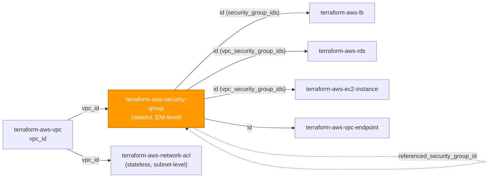
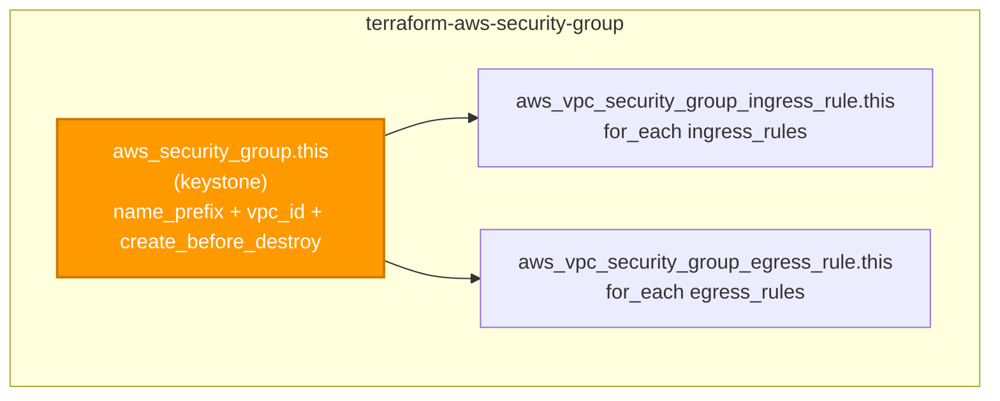

# 🟧 AWS **Security Group** Terraform Module

> **Provisions a stateful, ENI-level security group together with its inbound and outbound rules — one rule per resource, no implicit open ingress, no `0.0.0.0/0` unless you ask for it — from a single module call.** Built for the AWS provider **v6.x**.

[](https://www.terraform.io)
[](https://registry.terraform.io/providers/hashicorp/aws/latest)
[](#)
[](#)
[](#)

---

## 🧩 Overview

- 🧱 **One SG, fully wired.** Creates `aws_security_group` plus everything meaningless without it: its `aws_vpc_security_group_ingress_rule` and `aws_vpc_security_group_egress_rule` entries — the **modern one-rule-per-resource API**, never inline blocks and never the legacy `aws_security_group_rule`.
- 🔒 **Deny-all baseline.** An SG with an empty `ingress_rules` map allows **no** inbound traffic, and because Terraform strips AWS's default allow-all-egress rule, an empty `egress_rules` map allows **no** outbound traffic. Both directions are explicit and reviewable.
- 🚫 **No `0.0.0.0/0` by accident.** Open CIDRs are never defaulted — `0.0.0.0/0` appears only when a caller sets `cidr_ipv4 = "0.0.0.0/0"` on a specific rule (flag those in review).
- 🔑 **Stateful, ENI-level control.** A security group is the primary connection-tracking firewall attached to ENIs (instances, ALBs, RDS, endpoints). Reply traffic is allowed automatically — no ephemeral-port rules needed (that is the NACL's job).
- 🏷️ **Tags everywhere.** `var.tags` flows to the SG **and** every ingress/egress rule resource (all three are taggable); per-rule tags merge over the module tags, and the merged set surfaces as `tags_all`.
- 🔁 **Safe replacement.** `name`, `name_prefix`, `description`, and `vpc_id` are FORCE-NEW; the SG carries `create_before_destroy = true` so a replacement can stand up and dependents re-point **before** the old SG is revoked — sidestepping the classic `DependencyViolation` "Security Group Deletion Problem."
- 🌐 **Regional, VPC-scoped.** No `region` variable — the SG is created in the same Region/VPC as the `vpc_id` you wire in.

> 💡 **Why it matters:** The security group is the per-ENI firewall that decides what reaches an instance, load balancer, or database. In a regulated FI handling PII, a single over-broad ingress rule is the difference between a closed boundary and an open door — so this module makes every allowed path explicit, audited (descriptions are required), and least-privilege by default.

---

## ❤️ Support this project

If these Terraform modules have been helpful to you or your organization, I'd appreciate your support in any of the following ways:

- ⭐ **Star this repository** to help others discover this Terraform module.
- 🤝 **Connect with me on LinkedIn:** [linkedin.com/in/microsoftexpert](https://www.linkedin.com/in/microsoftexpert)
- ☕ **Buy me a coffee:** [buymeacoffee.com/microsoftexpert](https://buymeacoffee.com/microsoftexpert)

Whether it's a star, a professional connection, or a coffee, every gesture helps keep these modules actively maintained and continually improving. Thank you for being part of the community!

---

## 🗺️ Where this fits in the family

`terraform-aws-security-group` sits in the **networking** layer alongside `terraform-aws-network-acl`. It consumes `vpc_id` from `terraform-aws-vpc` and emits an `id` that compute, load-balancing, database, and endpoint modules attach to their ENIs.



---

## 🧬 What this module builds



| Resource | Count | Created when |
|---|---|---|
| `aws_security_group.this` | 1 | always (keystone) |
| `aws_vpc_security_group_ingress_rule.this` | 0..N | one per `ingress_rules` entry |
| `aws_vpc_security_group_egress_rule.this` | 0..N | one per `egress_rules` entry |

> ℹ️ Each rule is a **standalone resource** keyed by a stable caller label, so it gets its own `security_group_rule_id`, clean drift detection, and a granular plan diff — adding or removing one rule never churns the others, and changing a rule's port/protocol/source replaces only that one rule.

---

## ✅ Provider / Versions

| Requirement | Version |
|---|---|
| Terraform | `>= 1.12.0` |
| `hashicorp/aws` | `>= 6.0, < 7.0` |

The module declares only a `required_providers` block (`providers.tf`) and inherits the configured provider. There is **no `provider {}` block** and **no credential variable** — credentials resolve through the standard AWS chain at the root/pipeline level (env vars → SSO/shared credentials → `assume_role` → instance profile / IRSA → OIDC web identity).

---

## 🔑 Required IAM Permissions

Least-privilege actions the **Terraform execution identity** needs to manage this module.

| Action | Required for | Notes |
|---|---|---|
| `ec2:CreateSecurityGroup`, `ec2:DeleteSecurityGroup` | SG lifecycle | Core create/destroy of `aws_security_group` |
| `ec2:DescribeSecurityGroups` | Read / refresh | Plan & state refresh |
| `ec2:AuthorizeSecurityGroupIngress`, `ec2:RevokeSecurityGroupIngress` | Ingress rules | One authorize/revoke per `ingress_rules` item |
| `ec2:AuthorizeSecurityGroupEgress`, `ec2:RevokeSecurityGroupEgress` | Egress rules | One authorize/revoke per `egress_rules` item |
| `ec2:DescribeSecurityGroupRules` | Read individual rule resources | Each rule is its own resource with a `security_group_rule_id` |
| `ec2:ModifySecurityGroupRules` | In-place rule updates | Used when a rule attribute can be modified without replacement |
| `ec2:UpdateSecurityGroupRuleDescriptionsIngress`, `ec2:UpdateSecurityGroupRuleDescriptionsEgress` | Rule description updates | Descriptions are required per rule (auditability) |
| `ec2:CreateTags`, `ec2:DeleteTags` | Tagging | On the SG and on each rule resource; scope to `ec2:CreateAction = CreateSecurityGroup` |

> ⚠️ **No `iam:PassRole`, no service-linked role.** Security groups require neither.

> 🔒 Scope these actions with a condition on `ec2:Vpc` (the ARN of the target VPC) so the execution identity can only manage security groups inside the VPCs it owns.

---

## 📋 AWS Prerequisites

- **No service-linked role** is required for security groups.
- **No account opt-in** is required.
- **VPC must exist.** Wire `vpc_id` from `terraform-aws-vpc`. The SG is **regional and VPC-scoped** — it must be created in the same Region as the VPC it belongs to. Default-VPC use is discouraged in a regulated environment.
- **Referenced sources must exist in scope.** A `referenced_security_group_id` must be a peer SG in the same VPC (or an accepted VPC-peering / Transit Gateway path); a `prefix_list_id` must be a managed or AWS-managed prefix list reachable from the VPC.
- **Region.** Do **not** set a `region` variable; the caller's provider configuration selects the Region. There is **no `us-east-1` global-resource constraint** for security groups.
- **Quotas** (per [Amazon VPC quotas → Security groups](https://docs.aws.amazon.com/vpc/latest/userguide/amazon-vpc-limits.html)):
 - **2,500 security groups per VPC** (adjustable via Service Quotas).
 - **60 inbound + 60 outbound rules** per security group by default (adjustable). A single CIDR/port/protocol combination counts as one rule; a rule that lists multiple CIDRs counts once per CIDR.
 - **5 security groups per network interface** by default (raisable to 16).
 - The product of *rules per SG × SGs per ENI* must stay within **1,000** (default).

---

## 📁 Module Structure

```
terraform-aws-security-group/
├── providers.tf # required_providers (aws >= 6.0, < 7.0); no provider block; region/provider notes
├── variables.tf # name → name_prefix → vpc_id → description → revoke_rules_on_delete → ingress_rules → egress_rules → tags
├── main.tf # aws_security_group.this + ingress_rule (for_each) + egress_rule (for_each)
├── outputs.tf # id + arn + security_group_id + name + vpc_id + owner_id + rule id/arn maps + tags_all
├── README.md # this file
└── SCOPE.md # in/out-of-scope, IAM permissions, prerequisites, gotchas
```

---

## ⚙️ Quick Start

Smallest working call — an app SG allowing HTTPS in from an ALB SG and Postgres out to the database subnets, wired from `terraform-aws-vpc`:

```hcl
module "app_sg" {
  source = "git::https://github.com/microsoftexpert/terraform-aws-security-group?ref=v1.0.0"

  name_prefix = "casey-app-" # preferred over a fixed name (create_before_destroy-safe)
  vpc_id      = module.vpc.vpc_id
  description = "App tier — HTTPS from ALB, Postgres to DB"

  ingress_rules = {
    https-from-alb = { description = "HTTPS from ALB SG", ip_protocol = "tcp", from_port = 443, to_port = 443, referenced_security_group_id = module.alb_sg.id }
  }

  egress_rules = {
    pg-to-db = { description = "Postgres to DB subnets", ip_protocol = "tcp", from_port = 5432, to_port = 5432, cidr_ipv4 = "10.0.16.0/20" }
  }

  tags = {
    Environment = "prod"
    DataClass   = "internal"
  }
}
```

---

## 🔌 Cross-Module Contract

### Consumes

| Input | Type | Source module |
|---|---|---|
| `vpc_id` | `string` (VPC id) | `terraform-aws-vpc` |
| `ingress_rules[*].referenced_security_group_id` | `string` (SG id) | `terraform-aws-security-group` (peer SG) |
| `egress_rules[*].referenced_security_group_id` | `string` (SG id) | `terraform-aws-security-group` (peer SG) |
| `*.prefix_list_id` | `string` (PL id) | `terraform-aws-vpc-endpoint` (gateway-endpoint prefix list) / managed prefix lists |

> Networking module — it needs `vpc_id` from an upstream VPC; rules are optional (omit to leave the SG closed in both directions).

### Emits

| Output | Description | Consumed by |
|---|---|---|
| `id` | SG id (`sg-…`) | `terraform-aws-ec2-instance`, `terraform-aws-lb`, `terraform-aws-rds`, `terraform-aws-ecs-service`, `terraform-aws-eks`, `terraform-aws-vpc-endpoint`, `terraform-aws-elasticache`, peer SG `referenced_security_group_id` |
| `arn` | SG ARN `arn:aws:ec2:<region>:<account>:security-group/<id>` — the cross-resource reference type | IAM / SCP policy resource references |
| `security_group_id` | Alias of `id` for explicit cross-module wiring | route/subnet documentation, audits |
| `name` | SG name (the generated name when `name_prefix` was used) | tagging / monitoring / inventory |
| `vpc_id` | VPC the SG belongs to | inventory / audit |
| `owner_id` | AWS account id that owns the SG | audit |
| `ingress_rule_ids` | Map of rule label → `aws_vpc_security_group_ingress_rule` id (`security_group_rule_id`) | drift inspection |
| `egress_rule_ids` | Map of rule label → `aws_vpc_security_group_egress_rule` id | drift inspection |
| `ingress_rule_arns` / `egress_rule_arns` | Map of rule label → rule ARN | audit |
| `tags_all` | All tags incl. provider `default_tags` (resource tags win) | governance/audit |

---

## 📚 Example Library

<details>
<summary><strong>1 · Minimal — SG only (deny-all baseline, no rules)</strong></summary>

```hcl
module "baseline_sg" {
  source = "git::https://github.com/microsoftexpert/terraform-aws-security-group?ref=v1.0.0"

  name_prefix = "casey-baseline-"
  vpc_id      = module.vpc.vpc_id
  # no ingress_rules or egress_rules → denies ALL inbound and ALL outbound.
  # The secure starting point: attach it, then add only the paths you need.
}
```
</details>

<details>
<summary><strong>2 · HTTPS in from an ALB SG, egress to a database (the common app shape)</strong></summary>

```hcl
module "app_sg" {
  source = "git::https://github.com/microsoftexpert/terraform-aws-security-group?ref=v1.0.0"

  name_prefix = "casey-app-"
  vpc_id      = module.vpc.vpc_id

  ingress_rules = {
    # SG-to-SG reference — no CIDRs. The app only accepts traffic from the ALB.
    https-from-alb = { description = "HTTPS from ALB SG", ip_protocol = "tcp", from_port = 443, to_port = 443, referenced_security_group_id = module.alb_sg.id }
  }

  egress_rules = {
    pg-to-db = { description = "Postgres to DB SG", ip_protocol = "tcp", from_port = 5432, to_port = 5432, referenced_security_group_id = module.db_sg.id }
  }
}
```
</details>

<details>
<summary><strong>3 · Tags (merge with provider <code>default_tags</code>; per-rule tags)</strong></summary>

```hcl
# Caller's provider block owns default_tags; the module never sets it.
provider "aws" {
  default_tags { tags = { Owner = "platform", ManagedBy = "terraform" } }
}

module "tagged_sg" {
  source = "git::https://github.com/microsoftexpert/terraform-aws-security-group?ref=v1.0.0"

  name   = "casey-tagged" # static name → applied as the Name tag; wins over any Name key in var.tags
  vpc_id = module.vpc.vpc_id

  tags = {
    Environment = "prod" # resource tag — wins over default_tags on key conflict
    DataClass   = "internal"
  }

  ingress_rules = {
    # per-rule tags merge OVER var.tags (per-rule wins on key conflict)
    https-in = { description = "HTTPS from corp", ip_protocol = "tcp", from_port = 443, to_port = 443, cidr_ipv4 = "10.0.0.0/8", tags = { Tier = "edge" } }
  }
}

# module.tagged_sg.tags_all == { Owner, ManagedBy, Environment, DataClass, Name = "casey-tagged" }
```
</details>

<details>
<summary><strong>4 · Allow HTTPS from a corporate CIDR (IPv4)</strong></summary>

```hcl
module "corp_sg" {
  source = "git::https://github.com/microsoftexpert/terraform-aws-security-group?ref=v1.0.0"

  name_prefix = "casey-corp-"
  vpc_id      = module.vpc.vpc_id

  ingress_rules = {
    https-corp = { description = "HTTPS from corporate range", ip_protocol = "tcp", from_port = 443, to_port = 443, cidr_ipv4 = "10.0.0.0/8" }
  }
}
```
</details>

<details>
<summary><strong>5 · IPv6 ingress + dual-stack egress</strong></summary>

```hcl
module "dualstack_sg" {
  source = "git::https://github.com/microsoftexpert/terraform-aws-security-group?ref=v1.0.0"

  name_prefix = "casey-dualstack-"
  vpc_id      = module.vpc.vpc_id

  ingress_rules = {
    https-v6 = { description = "HTTPS over IPv6 from VPC", ip_protocol = "tcp", from_port = 443, to_port = 443, cidr_ipv6 = "fd00::/8" }
  }

  egress_rules = {
    https-out-v4 = { description = "HTTPS to internet (v4)", ip_protocol = "tcp", from_port = 443, to_port = 443, cidr_ipv4 = "0.0.0.0/0" }
    https-out-v6 = { description = "HTTPS to internet (v6)", ip_protocol = "tcp", from_port = 443, to_port = 443, cidr_ipv6 = "::/0" }
  }
}
```
</details>

<details>
<summary><strong>6 · Prefix-list source (e.g. an S3 gateway-endpoint prefix list)</strong></summary>

```hcl
module "s3_egress_sg" {
  source = "git::https://github.com/microsoftexpert/terraform-aws-security-group?ref=v1.0.0"

  name_prefix = "casey-s3egress-"
  vpc_id      = module.vpc.vpc_id

  egress_rules = {
    # Allow HTTPS only to the AWS S3 ranges behind the gateway endpoint's managed prefix list.
    s3-https = { description = "HTTPS to S3 via gateway endpoint PL", ip_protocol = "tcp", from_port = 443, to_port = 443, prefix_list_id = module.s3_endpoint.prefix_list_id }
  }
}
```
</details>

<details>
<summary><strong>7 · ICMP (allow ping/diagnostics from the VPC)</strong></summary>

```hcl
module "diag_sg" {
  source = "git::https://github.com/microsoftexpert/terraform-aws-security-group?ref=v1.0.0"

  name_prefix = "casey-diag-"
  vpc_id      = module.vpc.vpc_id

  ingress_rules = {
    # For ICMP, from_port = ICMP type, to_port = ICMP code. -1/-1 means all types/codes.
    icmp-in = { description = "ICMP echo from VPC", ip_protocol = "icmp", from_port = -1, to_port = -1, cidr_ipv4 = "10.0.0.0/16" }
  }
}
```
</details>

<details>
<summary><strong>8 · All-protocols ingress from a peer SG (no ports)</strong></summary>

```hcl
module "mesh_sg" {
  source = "git::https://github.com/microsoftexpert/terraform-aws-security-group?ref=v1.0.0"

  name_prefix = "casey-mesh-"
  vpc_id      = module.vpc.vpc_id

  ingress_rules = {
    # ip_protocol "-1" = all protocols/ports; omit from_port/to_port entirely.
    all-from-bastion = { description = "All traffic from bastion SG", ip_protocol = "-1", referenced_security_group_id = module.bastion_sg.id }
  }
}
```
</details>

<details>
<summary><strong>9 · Self-referencing SG (intra-group / cluster traffic)</strong></summary>

```hcl
# Two-stage pattern: create the SG, then reference its own id in a second apply,
# or supply a known id. The self-reference allows members of the same SG to talk.
module "cluster_sg" {
  source = "git::https://github.com/microsoftexpert/terraform-aws-security-group?ref=v1.0.0"

  name_prefix = "casey-cluster-"
  vpc_id      = module.vpc.vpc_id

  ingress_rules = {
    # Set referenced_security_group_id to THIS SG's own id once known
    # (e.g. via a data source, a known sg-id, or a second-pass apply).
    self-all = { description = "Intra-cluster all traffic", ip_protocol = "-1", referenced_security_group_id = module.cluster_sg.id }
  }
}
```
</details>

<details>
<summary><strong>10 · Database-tier SG (Postgres from app SG only)</strong></summary>

```hcl
module "db_sg" {
  source = "git::https://github.com/microsoftexpert/terraform-aws-security-group?ref=v1.0.0"

  name_prefix = "casey-db-"
  vpc_id      = module.vpc.vpc_id

  ingress_rules = {
    pg-from-app = { description = "Postgres from app SG", ip_protocol = "tcp", from_port = 5432, to_port = 5432, referenced_security_group_id = module.app_sg.id }
  }
  # No egress_rules → DB makes no outbound connections. Add one only if it must.
}
# Wire module.db_sg.id into terraform-aws-rds vpc_security_group_ids.
```
</details>

<details>
<summary><strong>11 · Static name vs name_prefix (FORCE-NEW identity)</strong></summary>

```hcl
# name and name_prefix are mutually exclusive and BOTH force-new.
# Prefer name_prefix in shared/regulated estates: a fixed name collides with
# create_before_destroy because the replacement SG would need the same unique name.
module "fixed_name_sg" {
  source = "git::https://github.com/microsoftexpert/terraform-aws-security-group?ref=v1.0.0"

  name   = "casey-legacy-app" # fixed name — only when an external system pins to it
  vpc_id = module.vpc.vpc_id
}
```
</details>

<details>
<summary><strong>12 · Break a circular SG dependency on destroy (<code>revoke_rules_on_delete</code>)</strong></summary>

```hcl
# When two SGs reference each other, neither can be deleted until its rules are
# revoked. Set revoke_rules_on_delete = true on ONE of them to break the cycle.
module "sg_a" {
  source = "git::https://github.com/microsoftexpert/terraform-aws-security-group?ref=v1.0.0"

  name_prefix            = "casey-a-"
  vpc_id                 = module.vpc.vpc_id
  revoke_rules_on_delete = true # revokes all rules before deleting this SG

  ingress_rules = {
    from-b = { description = "From SG B", ip_protocol = "-1", referenced_security_group_id = module.sg_b.id }
  }
}
```
</details>

<details>
<summary><strong>13 · Secure-by-default opt-out — open egress to the internet (use with care)</strong></summary>

```hcl
# The secure default is deny-all egress (Terraform strips AWS's default allow-all).
# This RELAXES it to allow all outbound — justify in your root module.
module "open_egress_sg" {
  source = "git::https://github.com/microsoftexpert/terraform-aws-security-group?ref=v1.0.0"

  name_prefix = "casey-open-egress-"
  vpc_id      = module.vpc.vpc_id

  egress_rules = {
    # Explicit 0.0.0.0/0 — appears ONLY because it is set here, never by default.
    all-out = { description = "All outbound to internet (justified)", ip_protocol = "-1", cidr_ipv4 = "0.0.0.0/0" }
  }
}
```
</details>

<details>
<summary><strong>14 · Multi-Region via provider alias (SG follows its VPC's Region)</strong></summary>

```hcl
# A security group must live in the same Region as its VPC. There is NO us-east-1
# global constraint here — pass whichever provider points at the VPC's Region.
module "eu_sg" {
  source    = "git::https://github.com/microsoftexpert/terraform-aws-security-group?ref=v1.0.0"
  providers = { aws = aws.eu_west_1 }

  name_prefix = "casey-eu-app-"
  vpc_id      = module.eu_vpc.vpc_id # eu_vpc also built with aws.eu_west_1

  egress_rules = {
    https-out = { description = "HTTPS to internet", ip_protocol = "tcp", from_port = 443, to_port = 443, cidr_ipv4 = "0.0.0.0/0" }
  }
}
```
</details>

<details>
<summary><strong>15 · End-to-end composition — VPC + ALB SG + App SG + DB SG (tiered)</strong></summary>

```hcl
# Networking foundation
module "vpc" {
  source = "git::https://github.com/microsoftexpert/terraform-aws-vpc?ref=v1.0.0"
  name   = "casey-core"
  cidr   = "10.0.0.0/16"
  #... subnets, NAT, flow logs
}

# Edge: ALB accepts HTTPS from the internet
module "alb_sg" {
  source = "git::https://github.com/microsoftexpert/terraform-aws-security-group?ref=v1.0.0"

  name_prefix = "casey-alb-"
  vpc_id      = module.vpc.vpc_id

  ingress_rules = {
    https-in = { description = "HTTPS from internet", ip_protocol = "tcp", from_port = 443, to_port = 443, cidr_ipv4 = "0.0.0.0/0" }
  }
  egress_rules = {
    to-app = { description = "To app SG on 443", ip_protocol = "tcp", from_port = 443, to_port = 443, referenced_security_group_id = module.app_sg.id }
  }
}

# App: accepts only from the ALB, talks only to the DB
module "app_sg" {
  source = "git::https://github.com/microsoftexpert/terraform-aws-security-group?ref=v1.0.0"

  name_prefix = "casey-app-"
  vpc_id      = module.vpc.vpc_id

  ingress_rules = {
    from-alb = { description = "HTTPS from ALB SG", ip_protocol = "tcp", from_port = 443, to_port = 443, referenced_security_group_id = module.alb_sg.id }
  }
  egress_rules = {
    to-db = { description = "Postgres to DB SG", ip_protocol = "tcp", from_port = 5432, to_port = 5432, referenced_security_group_id = module.db_sg.id }
  }
}

# Data: accepts only Postgres from the app
module "db_sg" {
  source = "git::https://github.com/microsoftexpert/terraform-aws-security-group?ref=v1.0.0"

  name_prefix = "casey-db-"
  vpc_id      = module.vpc.vpc_id

  ingress_rules = {
    pg-from-app = { description = "Postgres from app SG", ip_protocol = "tcp", from_port = 5432, to_port = 5432, referenced_security_group_id = module.app_sg.id }
  }

  tags = { Environment = "prod", DataClass = "confidential" }
}

# Wire the ids downstream:
# module.alb_sg.id → terraform-aws-lb security_groups
# module.app_sg.id → terraform-aws-ec2-instance / terraform-aws-ecs-service
# module.db_sg.id → terraform-aws-rds vpc_security_group_ids
```
</details>

---

## 📥 Inputs

| Name | Type | Default | Description |
|---|---|---|---|
| `name` | `string` | `null` | Static SG name, also applied as the `Name` tag (wins over a `Name` key in `tags`). **FORCE-NEW**, mutually exclusive with `name_prefix`. |
| `name_prefix` | `string` | `null` | Generates a unique name from this stem. **FORCE-NEW**, mutually exclusive with `name`. **Recommended** (create_before_destroy-safe). |
| `vpc_id` | `string` | — **required** | VPC the SG is created in. **FORCE-NEW** — an SG cannot move VPCs. |
| `description` | `string` | `"Managed by Terraform (terraform-aws-security-group)"` | SG description. **FORCE-NEW** — the API cannot edit it in place. |
| `revoke_rules_on_delete` | `bool` | `false` | Revoke all rules before deleting the SG. Set `true` on one side to break a circular SG dependency on destroy. |
| `ingress_rules` | `map(object({...}))` | `{}` | Inbound rules keyed by stable label; rendered as `aws_vpc_security_group_ingress_rule`. Empty → deny all inbound. |
| `egress_rules` | `map(object({...}))` | `{}` | Outbound rules — same schema as `ingress_rules`. Empty → deny all outbound (the AWS default allow-all is stripped). |
| `tags` | `map(string)` | `{}` | Tags for the SG **and** every rule resource (merge with `default_tags`; resource tags win). |

Each rule object: `description` (**required**, non-empty — auditability), `ip_protocol` (`"-1"`/`tcp`/`udp`/`icmp`/`icmpv6`/IANA number string, **required**), **exactly one** source/destination of `cidr_ipv4` / `cidr_ipv6` / `prefix_list_id` / `referenced_security_group_id`, and optional `from_port` / `to_port` (port range, or ICMP type/code) and per-rule `tags`. See `variables.tf` for full heredoc schemas and validation rules.

---

## 🧾 Outputs

| Name | Description |
|---|---|
| `id` | SG id (`sg-…`). |
| `arn` | SG ARN (cross-resource reference type). |
| `security_group_id` | Alias of `id` for explicit cross-module wiring. |
| `name` | SG name (the generated name when `name_prefix` was used). |
| `vpc_id` | VPC the SG belongs to. |
| `owner_id` | AWS account id that owns the SG. |
| `ingress_rule_ids` | Map of rule label → ingress rule id (`security_group_rule_id`). |
| `egress_rule_ids` | Map of rule label → egress rule id. |
| `ingress_rule_arns` / `egress_rule_arns` | Map of rule label → rule ARN. |
| `tags_all` | All tags incl. provider `default_tags`. |

---

## 🧠 Architecture Notes

- **ARN format:** `arn:aws:ec2:<region>:<account-id>:security-group/<sg-id>`. This is a **regional** resource — the ARN carries a region segment. Individual rules have their own ARN `arn:aws:ec2:<region>:<account-id>:security-group-rule/<sgr-id>`.
- **ID format:** the `id` is the SG id `sg-0123456789abcdef0`. Each rule resource exposes a `security_group_rule_id` `sgr-…`, surfaced per-label in `ingress_rule_ids` / `egress_rule_ids`.
- **Force-new fields:** `name`, `name_prefix`, `description`, and `vpc_id` are **all force-new** — changing any one destroys and recreates the SG **and every rule**. `create_before_destroy = true` on the SG lets the replacement come up and dependents re-point before the old SG is revoked; this is why `name_prefix` is preferred (two SGs with the same fixed unique name cannot coexist during the swap).
- **One-rule-per-resource semantics.** Rules are standalone `aws_vpc_security_group_ingress_rule` / `..._egress_rule` resources, **not** inline `ingress`/`egress` blocks and **not** the legacy `aws_security_group_rule`. Mixing the inline form with standalone resources makes the provider fight over rule ownership. Changing a rule's port/protocol/source is a **replace of that single rule resource**, not an in-place edit of a monolithic block — so plans stay granular and drift is per-rule.
- **Stateful evaluation.** Security groups track connections — an allowed inbound flow's reply is permitted automatically, and vice versa. You do **not** add ephemeral-port rules (that is the stateless NACL's concern). Rules are purely allow-lists; there is no deny rule — absence is denial.
- **Exactly one source per rule.** A rule sets exactly one of `cidr_ipv4`, `cidr_ipv6`, `prefix_list_id`, or `referenced_security_group_id` (validated at plan time). SG-to-SG references are preferred over CIDRs for east-west traffic because they track membership rather than addresses.
- **`tags` ↔ `tags_all` ↔ `default_tags`:** `var.tags` is applied to the SG and to **every** rule resource (all three types are taggable); per-rule `tags` merge over `var.tags` with **per-rule winning**. `tags_all` is the provider-computed merge of resource tags over provider `default_tags`, with **resource tags winning** on key conflict. `default_tags` is configured in the caller's provider block — **never** inside this module.
- **`var.name` → `Name` tag.** When `var.name` is set it is merged in as the `Name` tag and **overrides** any `Name` key supplied in `var.tags`. `name_prefix` does not set a `Name` tag (there is no static name to surface).
- **Destroy ordering.** An SG **cannot be deleted while still attached to an ENI** (instance, ALB, RDS, NAT gateway, VPC endpoint). Detach/delete consumers first; the rule resources are torn down before the SG via the graph. For mutually-referencing SGs, set `revoke_rules_on_delete = true` on one to break the cycle.
- **Eventual consistency.** EC2 control-plane changes can lag briefly — a freshly deleted consumer ENI may keep the SG reported as "in use" for a short window, and a new SG may not be immediately reflected in a separate Describe call. In-graph dependencies make this transparent within a single apply.
- **us-east-1 globals:** N/A. Security groups are regional and VPC-scoped — no region-pinned provider alias is ever required.

---

## 🧱 Design Principles

Secure-by-default posture and every opt-out, explicitly:

| Posture | Default | Opt-out |
|---|---|---|
| Ingress | **none** — empty `ingress_rules` denies all inbound | add explicit `ingress_rules` entries |
| Egress | **none** — Terraform strips AWS's default allow-all-egress; empty `egress_rules` denies all outbound | add explicit `egress_rules` (incl. `0.0.0.0/0` only if justified) |
| `0.0.0.0/0` ingress/egress | **never defaulted** | appears only when a rule sets `cidr_ipv4 = "0.0.0.0/0"` explicitly (flag in review) |
| Rule descriptions | **required** and non-empty (auditability) | n/a (enforced by validation) |
| Source/destination | exactly one of CIDR / prefix-list / referenced-SG per rule | n/a (enforced by validation) |
| Replacement safety | `create_before_destroy = true` + `name_prefix` recommended | use a fixed `name` only when an external system pins to it |
| Region | none (provider-inherited; same Region as the VPC) | pass a provider alias for another Region |

> Security groups hold **no data at rest**, so encryption defaults are N/A. The secure posture here is the **deny-all baseline in both directions** plus mandatory rule descriptions and least-privilege, SG-to-SG-preferred sources. Document each opt-out (especially Example 13's open egress and any `0.0.0.0/0`) in your root module so reviewers can see what was loosened.

Other principles:
- **One composite, one keystone.** The SG owns only what is meaningless without it — its ingress and egress rules. The VPC, peer SGs, and prefix lists it references are authored elsewhere.
- **`for_each`, never `count`,** for rules — keyed by stable caller labels so reorders and single-rule edits don't churn the plan.
- **Modern API only.** One-rule-per-resource (`aws_vpc_security_group_(in|e)gress_rule`), never inline blocks, never the deprecated `aws_security_group_rule`.
- **Defense-in-depth.** The stateful SG is the primary, per-ENI control; pair it with a stateless `terraform-aws-network-acl` for a coarse subnet-level backstop.
- **Primary outputs `id` + `arn`**, plus `security_group_id`, the rule id/arn maps, and `tags_all`.

---

## 🚀 Runbook

```powershell
# Validate without backend or credentials
terraform init -backend=false
terraform validate
terraform fmt -check
```

> `plan` / `apply` require valid AWS credentials (profile / SSO / OIDC) resolved through the standard provider chain, plus the EC2 actions listed above and a configured Region. Always pin the module with `?ref=v1.0.0` — never a branch.

---

## 🧪 Testing

- `terraform init -backend=false && terraform validate` — schema + reference integrity.
- `terraform fmt -check` — canonical formatting.
- `terraform plan` against a sandbox VPC to confirm the SG and its standalone ingress/egress rules materialize as expected.
- Assert `module.<name>.id`, `arn`, `ingress_rule_ids`, `egress_rule_ids`, and `tags_all` in your root-module test harness.
- Validation coverage (all caught at `plan` time by `variables.tf`): an empty rule `description`, an invalid `ip_protocol`, supplying both `name` and `name_prefix`, a malformed `vpc_id`, and supplying zero or more than one source/destination per rule.

---

## 💬 Example Output

```text
module.app_sg.aws_security_group.this: Creation complete after 2s [id=sg-0a1b2c3d4e5f60718]
module.app_sg.aws_vpc_security_group_ingress_rule.this["https-from-alb"]: Creation complete [id=sgr-0abc123...]
module.app_sg.aws_vpc_security_group_egress_rule.this["pg-to-db"]: Creation complete [id=sgr-0def456...]

Outputs:
arn = "arn:aws:ec2:us-east-1:123456789012:security-group/sg-0a1b2c3d4e5f60718"
id = "sg-0a1b2c3d4e5f60718"
security_group_id = "sg-0a1b2c3d4e5f60718"
ingress_rule_ids = { "https-from-alb" = "sgr-0abc123..." }
egress_rule_ids = { "pg-to-db" = "sgr-0def456..." }
tags_all = { "DataClass" = "internal", "Environment" = "prod", "Name" = "casey-app" }
```

---

## 🔍 Troubleshooting

| Symptom | Likely cause | Fix |
|---|---|---|
| Outbound traffic blocked despite no egress rules expected | Terraform **strips** AWS's default allow-all-egress; an empty `egress_rules` map denies all outbound | Add the egress rule(s) the workload needs (Examples 5, 13) |
| `DependencyViolation` deleting the SG | SG still attached to an ENI (instance, ALB, RDS, NAT, endpoint) | Delete/detach the consumer first; eventual consistency may report it in use briefly after the consumer is gone |
| Two SGs reference each other and neither will destroy | Circular rule dependency | Set `revoke_rules_on_delete = true` on one SG (Example 12) |
| `InvalidParameterValue: security group... already exists` on replace | Fixed `name` collides with `create_before_destroy` (replacement needs the same unique name) | Use `name_prefix` instead of `name` (Example 11) |
| Plan wants to recreate the whole SG over a small change | `name` / `name_prefix` / `description` / `vpc_id` is **force-new** | Expected — these cannot be edited in place; `create_before_destroy` avoids downtime |
| `Conflicting configuration arguments` on a rule | More than one of `cidr_ipv4`/`cidr_ipv6`/`prefix_list_id`/`referenced_security_group_id` set | Set exactly one source per rule (enforced by validation) |
| Validation error: description required | A rule has an empty `description` | Every rule must carry a non-empty audit description |
| Self-reference apply fails on first run | The SG's own id isn't known until it exists | Use a second-pass apply or a data source for the self `referenced_security_group_id` (Example 9) |
| Tag drift on every plan | A tag also set by provider `default_tags` with a different value | Let resource tags win, or remove the overlap from `default_tags` |
| `AccessDenied: ec2:AuthorizeSecurityGroupIngress` | Execution identity lacks rule permissions | Grant the EC2 actions in the Required IAM Permissions table, scoped to the VPC |
| Hit the 60-rule limit per direction | Default quota reached | Request an increase via Service Quotas, consolidate CIDRs, or use prefix lists / SG references |

---

## 🔗 Related Docs

- [Security groups for your VPC](https://docs.aws.amazon.com/vpc/latest/userguide/vpc-security-groups.html)
- [Security group rules](https://docs.aws.amazon.com/vpc/latest/userguide/security-group-rules.html)
- [Amazon VPC quotas → Security groups](https://docs.aws.amazon.com/vpc/latest/userguide/amazon-vpc-limits.html)
- [Managed prefix lists](https://docs.aws.amazon.com/vpc/latest/userguide/managed-prefix-lists.html)
- Terraform: [`aws_security_group`](https://registry.terraform.io/providers/hashicorp/aws/latest/docs/resources/security_group) · [`aws_vpc_security_group_ingress_rule`](https://registry.terraform.io/providers/hashicorp/aws/latest/docs/resources/vpc_security_group_ingress_rule) · [`aws_vpc_security_group_egress_rule`](https://registry.terraform.io/providers/hashicorp/aws/latest/docs/resources/vpc_security_group_egress_rule)
- Sibling modules: `terraform-aws-vpc`, `terraform-aws-network-acl`, `terraform-aws-lb`, `terraform-aws-rds`, `terraform-aws-vpc-endpoint`
- Module internals: `SCOPE.md`

---

> 🧡 *"Infrastructure as Code should be standardized, consistent, and secure."*
